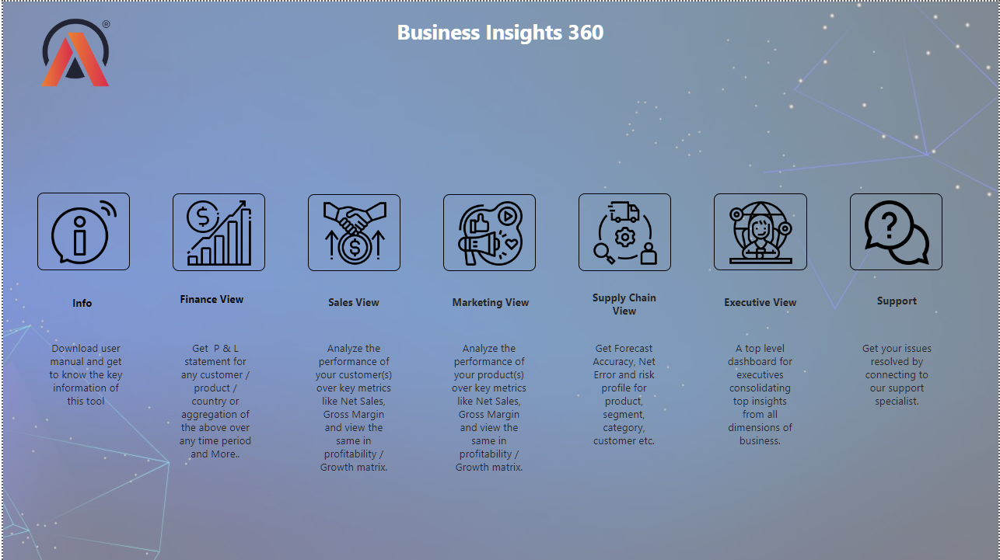
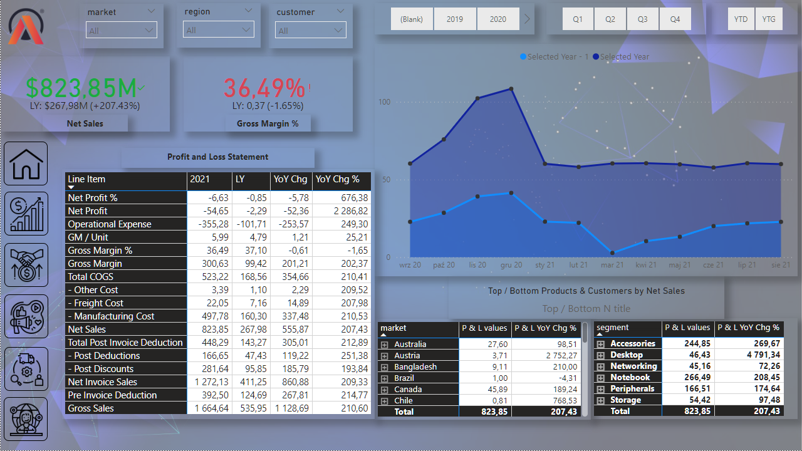
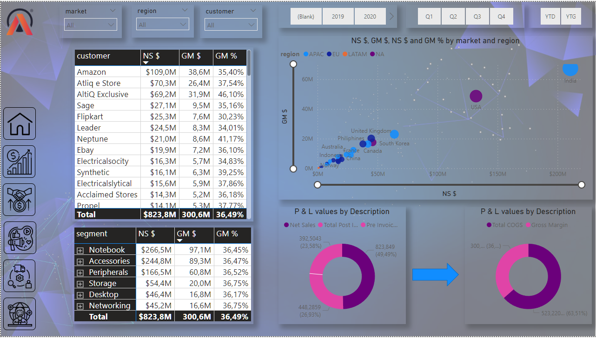
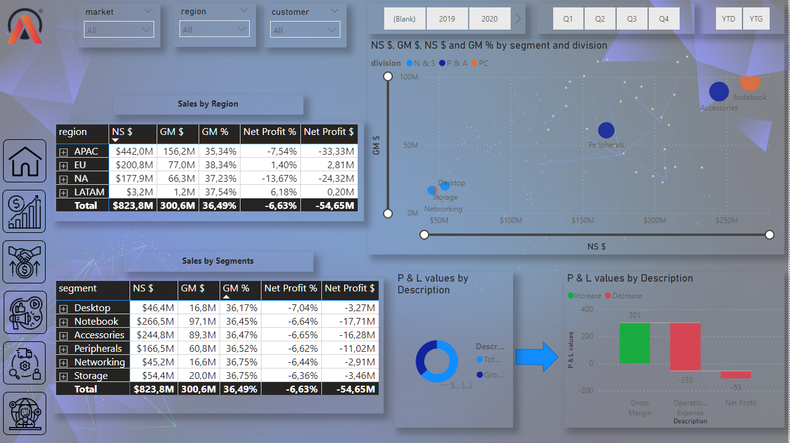
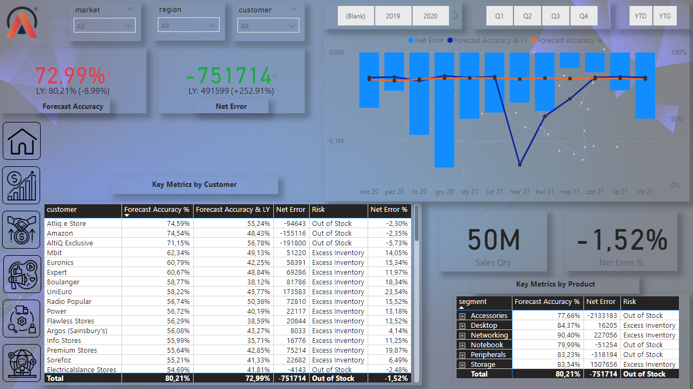
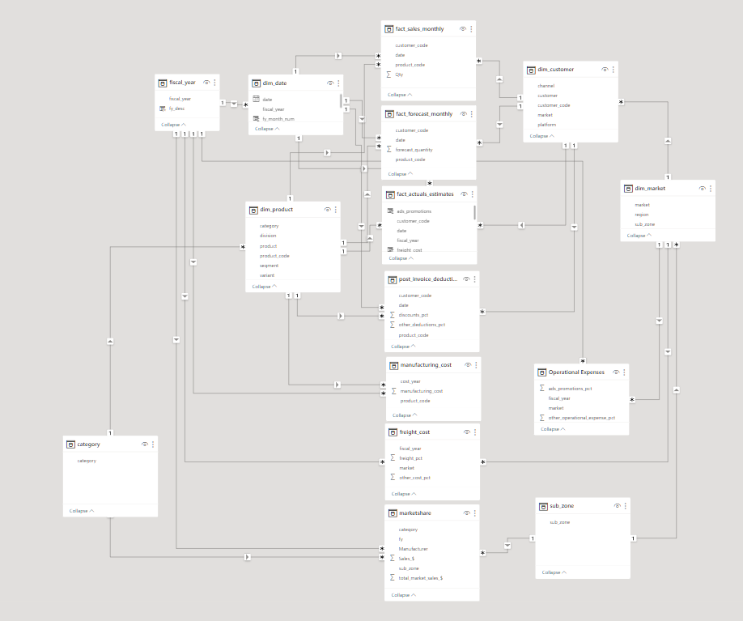

# Business Insights 360 Dashboard for Finance, Sales, Marketing, and Supply Chain

## Overview

Welcome to the Business Insights 360 Dashboard repository! This project aims to provide a comprehensive reporting solution for stakeholders in finance, sales, marketing, and the executive team. The dashboard incorporates robust data modeling, user-centric design, and drillable insights to facilitate in-depth analysis.

### Key Features

1. **Robust Data Modeling:**
   - Utilized Power Query for basic and advanced operations.
   - Implemented basic and complex DAX formulas.
   - Involved data modeling with over 10 interconnected tables for a holistic representation of business data.

2. **User-Empathetic Report Design:**
   - Applied user-centric design principles for an enhanced user experience.
   - Selected appropriate visuals and formatting for easy data interpretation.
   - Integrated drillable insights for a deeper dive into specific metrics.

3. **Drillable Insights:**
   - Implemented drill-down functionalities for detailed analysis.
   - Leveraged bookmarks for seamless navigation.
   - Incorporated stakeholder feedback for continuous improvement.

### Project Components

- **Tools Used:**
  - Power BI
  - SQL

- **Deployment:**
  - Utilized Power BI service for accessible deployment.

- **Additional Notes:**
  - The project was developed during a bootcamp organized by codebasics and AtliQ.
  - Real-world data from AtliQ was used, preventing the sharing of the original Power BI file on GitHub.

### Project Showcase

1. **Landing Page:**
   - Centralized hub with hyperlinks leading to each specific dashboard used in the project.
     
    

2. **Finance View:**
   - Presents Profit and Loss statements with dynamic filters based on criteria such as country, product, and region.
   - 
  

3. **Sales View:**
   - Analyzes customer performance, incorporating key performance indicators (KPIs) like Net Sales and Gross Margin.
   - 
   

4. **Marketing View:**
   - Evaluates product performance with KPIs including Net Sales and Gross Margin.
   - 
   

5. **Supply Chain:**
   - Comprehensive analysis featuring metrics such as forecast accuracy, net error, risk profile for products, sentiment, and category.
   - 
  
6. **Model View:**
  
      
  

 7. **Disclaimer:**
This project was undertaken as part of my learning journey in a bootcamp organized by Codebasics and Atliq.
It's important to note that the data used for this analysis is proprietary to Atliq Hardwares, and due to confidentiality reasons, the actual Excel files with the raw data cannot be shared on this public GitHub repository.

